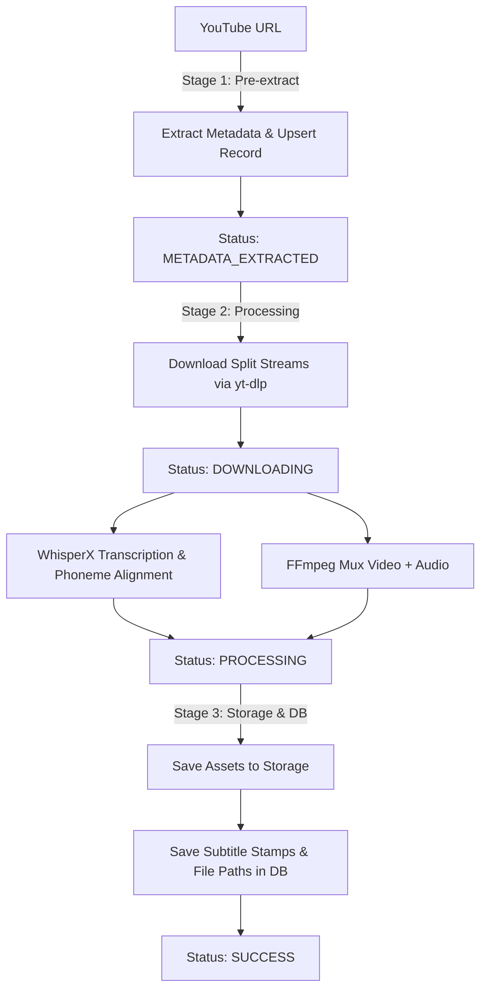

# YouTube Media Ingestion & WhisperX Subtitle Processing Pipeline

A modular, decoupled ingestion and processing pipeline that downloads YouTube videos, extracts high-accuracy word-level subtitles using **WhisperX**, muxes media streams losslessly with **FFmpeg**, and persists metadata and timestamps in a structured repository.

---

## Features

- **Split-Stream Ingestion**: Downloads the highest quality audio and video streams separately using `yt-dlp` to bypass stream bandwidth restrictions.
- **Word-Level Subtitle Alignment**: Generates phoneme-aligned word timestamps with **WhisperX**, producing both `.srt` and `.json` subtitle files.
- **Lossless Media Muxing**: Combines video and audio streams into standard MP4 containers using `ffmpeg` stream copying (`-c:v copy -c:a aac`) without slow re-encoding.
- **Zero-Click Shorts / Reels Autoplay Engine**: Search across all saved videos at once and automatically watch matched utterance clips consecutively like TikTok/Instagram Reels/YouTube Shorts, with seamless cross-video transitions and a floating HUD.
- **Clean / Hexagonal Architecture**: Core pipeline logic is decoupled from external tools and storage via explicit Python `Protocol` interfaces, enabling easy migration to cloud infrastructure (e.g., GCP Cloud Storage, Cloud SQL, BigQuery, Firestore).
- **High-Performance Metadata Persistence**: SQLite database with Write-Ahead Logging (WAL), busy timeout handling, and memory-optimized summary queries (`list_summaries`) to prevent RAM bloat on large subtitle sets.
- **CLI & Web Workflows**: Process single URLs, batch URL text files, inspect database records, export highlight reels via terminal, or search and enjoy continuous playback in the browser.


---

## Architecture & Pipeline Flow

The pipeline executes in 3 distinct stages orchestrated by `PipelineOrchestrator`:



### 1. Stage 1: Metadata Pre-Extraction
- Extracts video ID, title, channel, duration, view count, and thumbnail without downloading media streams.
- Upserts the record into the metadata repository.
- Skips already completed videos unless `--force` is specified.

### 2. Stage 2: Download & Processing
- Downloads best audio (`.m4a`/best) and video (`.mp4`/best) streams into an isolated temporary workspace.
- Transcribes and aligns speech phonetically with `WhisperX` to obtain exact word boundaries (`start`, `end`, `score`).
- Muxes audio and video tracks into a unified MP4 file.

### 3. Stage 3: Storage & Persistence
- Moves final video, audio, `.srt`, and `.json` files into categorized storage (`data/storage/`).
- Stores the full word-level timestamp JSON string (`subtitle_stamp`) and file paths in the database.
- Marks status as `SUCCESS` and cleans up temporary working directories.

---

## Project Structure

```
.
├── main.py                     # CLI entrypoint
├── run_ui.py                   # Web UI runner
├── config.py                   # Global configuration & directory management
├── requirements.txt            # Python dependencies
├── urls.example.txt            # Sample batch URL input file
├── core/                       # Domain models and business logic (Ports)
│   ├── interfaces.py           # Protocol interfaces (Storage, Downloader, DB, Transcriber, Player)
│   ├── models.py               # VideoRecord, HighlightClip, CrossVideoSearchResult
│   ├── orchestrator.py         # 3-Stage Pipeline Orchestrator
│   ├── highlight.py            # KeywordHighlightService (Phoneme search & cross-video aggregation)
│   └── player.py               # VideoPlayerService (Playback & Segment/Search coordination)
├── adapters/                   # Implementation adapters (Adapters)
│   ├── database/
│   │   └── sqlite.py           # SQLite repository with WAL mode & list_summaries
│   ├── downloader/
│   │   └── ytdlp.py            # yt-dlp metadata extractor & stream downloader
│   ├── player/
│   │   └── ffplay.py           # FFplay media player adapter
│   ├── processor/
│   │   └── ffmpeg.py           # FFmpeg muxer & stream-copy clip concatenator
│   ├── storage/
│   │   └── local.py            # Local filesystem storage backend
│   ├── transcriber/
│   │   └── whisperx.py         # WhisperX transcription & alignment adapter
│   └── web/                    # FastAPI web application & Shorts/Reels player
│       ├── app.py              # FastAPI app factory
│       ├── routes/             # API routes (/api/search, /api/videos, stream, vtt)
│       ├── services/           # HTTP 206 range streaming service
│       ├── static/             # CSS & Shorts/Reels autoplay engine JS
│       └── templates/          # Minimalist player HTML with Reels HUD
├── data/                       # Local data directory (ignored by git)
│   ├── metadata.db             # SQLite database
│   ├── storage/                # Categorized asset storage (videos, audios, subtitles)
│   └── temp/                   # Transient processing workspaces
└── tests/                      # Hermetic unit & integration tests
    ├── test_ffmpeg.py          # FFmpeg muxing & timestamp parsing tests
    ├── test_highlight.py       # Punctuation tolerance & cross-video search tests
    ├── test_models_and_db.py   # Database CRUD & models tests
    ├── test_pipeline_orchestrator.py
    ├── test_player.py          # Player service tests
    ├── test_storage.py         # Storage backend tests
    └── test_web_api.py         # Hermetic FastAPI endpoints & streaming tests
```


---

## Prerequisites

1. **Python 3.10+** (Python 3.10 - 3.12 recommended for WhisperX compatibility)
2. **FFmpeg**: Ensure `ffmpeg` is installed and available on your system `PATH`.
   - **macOS** (Homebrew):
     ```bash
     brew install ffmpeg
     ```
   - **Ubuntu / Debian**:
     ```bash
     sudo apt update && sudo apt install ffmpeg
     ```
3. **GPU with CUDA (Optional but Recommended)**: WhisperX runs significantly faster on NVIDIA GPUs with CUDA, but will automatically fall back to CPU.

---

## Installation

1. **Clone the repository**:
   ```bash
   git clone <repository-url>
   cd <repository-folder>
   ```

2. **Create and activate a virtual environment**:
   ```bash
   python3 -m venv .venv
   source .venv/bin/activate
   ```

3. **Install PyTorch**:
   Install the appropriate PyTorch build for your system from [pytorch.org](https://pytorch.org/):
   - **CUDA (Linux/Windows)**:
     ```bash
     pip install torch torchaudio --index-url https://download.pytorch.org/whl/cu121
     ```
   - **CPU / Apple Silicon (macOS)**:
     ```bash
     pip install torch torchaudio
     ```

4. **Install Python dependencies**:
   ```bash
   pip install -r requirements.txt
   ```

---

## CLI Usage

### 1. Process a Single Video
```bash
python main.py --url "https://www.youtube.com/watch?v=0af9-s2WSxQ"
```

### 2. Process a Batch of Videos from File
Create a text file containing YouTube URLs (one per line, `#` for comments), such as `urls.example.txt`:
```bash
python main.py --file urls.example.txt
```

### 3. List Ingested Records
Displays a summary table of all processed videos in the database:
```bash
python main.py --list
```

### 4. Inspect Video Record & Subtitle Segments
View metadata, output paths, and preview word-level aligned subtitle segments for a specific video ID:
```bash
python main.py --show "0af9-s2WSxQ"
```

### 5. Play Video with ffplay
Play a saved video directly from the database using the ffplay player module:

```bash
# Play complete video (subtitles enabled by default if available)
python main.py --play "0af9-s2WSxQ"

# Start at 30 seconds and play for 15 seconds
python main.py --play "0af9-s2WSxQ" --seek 30 --duration 15

# Jump directly to a specific WhisperX subtitle segment (0-based index)
python main.py --play "0af9-s2WSxQ" --segment 5

# Search spoken words in subtitles and jump directly to the timestamp
python main.py --play "0af9-s2WSxQ" --search "포르쉐"

# Keyword-based highlight: sequentially play all sentence clips containing "롤렉스"
python main.py --play "0af9-s2WSxQ" --highlight "롤렉스" --mode sequential

# Keyword-based highlight: seamless concatenated playback in a single player window
python main.py --play "0af9-s2WSxQ" --highlight "롤렉스" --mode concat

# Keyword-based highlight: export concatenated highlight video to file
python main.py --play "0af9-s2WSxQ" --highlight "롤렉스" --export-highlight "rolex_highlights.mp4"

# Play in fullscreen with custom volume (0-100) and without subtitles
python main.py --play "0af9-s2WSxQ" --fs --volume 70 --no-sub
```

### 6. Interactive Web UI (Zero-Click Shorts / Reels Continuous Autoplay)
Launch the minimalist web player interface to search subtitle keywords across all saved videos and enjoy instant, continuous playback:

```bash
# Launch via standalone runner (auto-opens browser at http://localhost:8000)
python run_ui.py

# Or launch via main CLI
python main.py --ui
```

- **Zero-Click Continuous Autoplay**: Type any keyword (e.g. `롤렉스`, `시계`, `쇼핑`) and press **Enter**. Playback begins immediately with zero extra clicks or selection menus.
- **Cross-Video Consecutive Traversal**: Automatically plays every matching highlight clip consecutively across all saved videos in the database. When a clip ends, the player seamlessly transitions to the next clip and switches video sources/subtitles in real-time.
- **Clean Video View**: No obstructive overlays on the screen—pure video playback.
- **Keyboard Navigation**:
  - **`↓` (Arrow Down) or `J`**: Next highlight clip
  - **`↑` (Arrow Up) or `K`**: Previous highlight clip
  - **`Space`**: Toggle Pause / Resume


#### REST API Endpoints

| Method | Endpoint | Description |
|---|---|---|
| `GET` | `/api/search?keyword=...` | Cross-video search returning a flattened sequential playlist of highlight clips across all saved videos |
| `GET` | `/api/videos` | Lightweight list of playable videos (using `list_summaries`) |
| `GET` | `/api/videos/{video_id}` | Detailed metadata for a single video record |
| `GET` | `/api/videos/{video_id}/search?keyword=...` | Single-video keyword highlight clip search |
| `GET` | `/api/videos/{video_id}/stream` | HTTP 206 Partial Content range stream for instant seeking |
| `GET` | `/api/videos/{video_id}/subtitles.vtt` | WebVTT subtitle track (with dialogue punctuation preserved) |


### 7. CLI Options & Flags

| Flag | Argument | Description | Default |
|---|---|---|---|
| `--url` | `<URL>` | Single YouTube video URL to process | None |
| `--file` | `<FILEPATH>` | Path to text file containing URLs | None |
| `--list` | - | List all video records in SQLite database | `False` |
| `--show` | `<VIDEO_ID>` | Show details and word timestamps for video | None |
| `--play` | `<VIDEO_ID>` | Play video from DB via ffplay | None |
| `--seek`, `--start` | `<SECONDS>` | Playback start time in seconds | `None` |
| `--duration`, `-t` | `<SECONDS>` | Playback duration in seconds | `None` |
| `--segment` | `<INDEX>` | Play a specific WhisperX subtitle segment index | `None` |
| `--search` | `<QUERY>` | Search spoken text in subtitles and play first match | `None` |
| `--highlight` | `<KEYWORD>` | Search all subtitle sentences and play highlights sequentially or concatenated | `None` |
| `--mode` | `sequential` \| `concat` | Highlight playback mode | `sequential` |
| `--padding` | `<SECONDS>` | Sentence boundary padding in seconds | `0.2` |
| `--merge-gap` | `<SECONDS>` | Gap threshold to merge contiguous/adjacent clips | `0.5` |
| `--export-highlight` | `<FILEPATH>` | Export concatenated highlight MP4 file with rebased SRT | `None` |
| `--no-sub` | - | Disable subtitle overlay | `False` |
| `--fs`, `--fullscreen` | - | Launch player in fullscreen mode | `False` |
| `--volume` | `<0-100>` | Playback volume level | `None` |
| `--model` | `<MODEL>` | WhisperX model size (`tiny`, `base`, `small`, `medium`, `large-v2`) | `medium` |
| `--device` | `cpu` \| `cuda` | Compute device (auto-detects CUDA) | Auto |
| `--compute-type` | `float16` \| `int8` \| `float32` | CTranslate2 quantization type | Auto |
| `--force` | - | Re-process video even if marked `SUCCESS` | `False` |
| `-v`, `--verbose` | - | Enable detailed debug logs | `False` |

---

## Database Schema & Output

The SQLite repository stores the following fields in table `video_records`:

| Field | Type | Description |
|---|---|---|
| `video_id` | `TEXT PRIMARY KEY` | YouTube video identifier |
| `url` | `TEXT` | Source video URL |
| `title` | `TEXT` | Video title |
| `channel` | `TEXT` | Channel / uploader name |
| `duration_seconds` | `INTEGER` | Video length in seconds |
| `upload_date` | `TEXT` | Original upload date (`YYYYMMDD`) |
| `view_count` | `INTEGER` | Total view count |
| `description` | `TEXT` | Video description |
| `thumbnail_url` | `TEXT` | Thumbnail image URL |
| `status` | `TEXT` | `PENDING`, `METADATA_EXTRACTED`, `DOWNLOADING`, `PROCESSING`, `SUCCESS`, `FAILED` |
| `error_message` | `TEXT` | Traceback/error reason if failed |
| `merged_video_path` | `TEXT` | Absolute path to final muxed MP4 |
| `audio_path` | `TEXT` | Absolute path to stored audio file |
| `subtitle_json_path` | `TEXT` | Path to WhisperX `.json` output |
| `subtitle_srt_path` | `TEXT` | Path to standard `.srt` subtitle file |
| `subtitle_stamp` | `TEXT` | Serialized JSON containing word-level aligned segments |
| `created_at` | `TEXT` | ISO 8601 UTC timestamp |
| `updated_at` | `TEXT` | ISO 8601 UTC timestamp |

### Example Word-Level Subtitle Structure
```json
[
  {
    "start": 0.45,
    "end": 2.10,
    "text": " Welcome back to the channel.",
    "words": [
      {"word": "Welcome", "start": 0.45, "end": 0.85, "score": 0.98},
      {"word": "back", "start": 0.88, "end": 1.10, "score": 0.95},
      {"word": "to", "start": 1.12, "end": 1.25, "score": 0.99},
      {"word": "the", "start": 1.26, "end": 1.40, "score": 0.97},
      {"word": "channel.", "start": 1.42, "end": 2.10, "score": 0.96}
    ]
  }
]
```

---

## Extensibility & Cloud Migration

Thanks to the **Ports and Adapters** pattern (`core/interfaces.py`), you can swap local implementations with cloud equivalents without modifying core business logic:

- **Storage**: Swap `LocalStorageBackend` with a `GCSStorageBackend` (Google Cloud Storage) or `S3StorageBackend` by implementing `StorageBackend`.
- **Database**: Swap `SQLiteMetadataRepository` with `PostgresRepository` (Cloud SQL) or `FirestoreRepository` by implementing `MetadataRepository`.
- **Transcriber**: Swap `WhisperXTranscriber` with cloud ASR APIs (Google Cloud Speech-to-Text v2, OpenAI Whisper API) by implementing `AudioTranscriber`.

---

## Running Tests

Run the complete hermetic test suite using `pytest`:
```bash
pytest -v
```
All 43 unit and integration tests (covering audio/video muxing, timestamp parsing, cross-video search aggregation, database operations, and REST APIs) execute hermetically in under 1 second without depending on local host video files.


---

## License

MIT License
